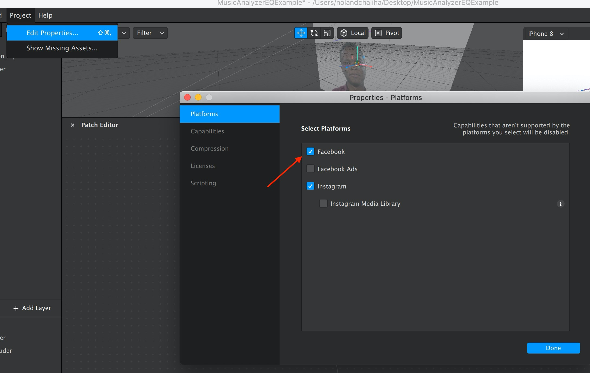
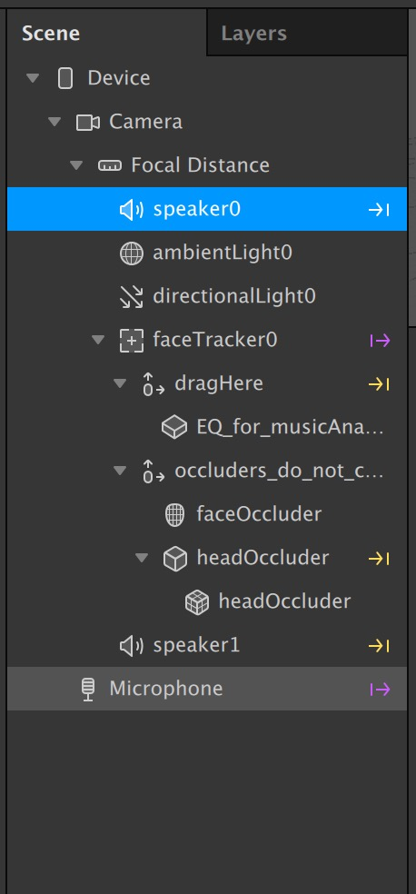

# Audio Analyzer / Energy Meter

## Setting up a scene with Audio Analyzer

Step Zero: Uncheck Facebook from your publishing platform preferences in the Edit Properties panel

**Step One: Add a speaker to your scene.**

**Step 2: Add Audio Analyzer Patch to patch graph**

**Step 3. Click + add object or left click in the scene click +add object or left click in the scene hierarchy to add object**

**Step 4. Find Audio Analyzer patch-- click add patch to add object**

**Step 5. Add Microphone to scene**

**Step 6. Connect microphone to Audio Analyzer input**

**Step 7. Connect Audio Analyzer output to the speaker you added to the scene in Step 1.**

**Step 8. Send the effect to instagram camera to test.** 

To test this effect you must mirror to your Instagram Camera and record in instagram to activate the music analyzer 


Note: At the moment the Audio Analyzer patch only works on the instagram platform



Note: At the moment the Audio Analyzer patch will only drive signals when the user is recording in Instagram


